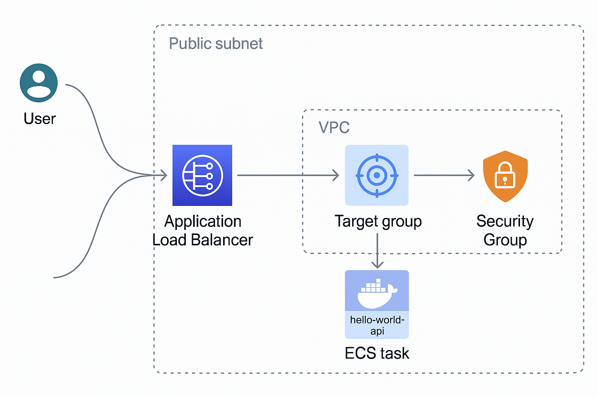
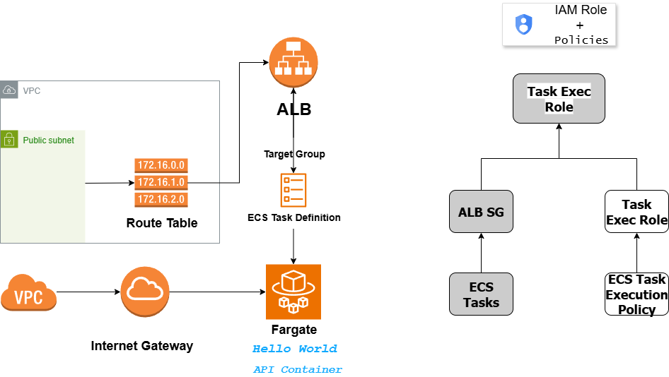

# 🐋 Dockerized Hello World API on AWS with Terraform

## This project provisions a cloud infrastructure on AWS using Terraform to deploy a Dockerized API [nmatsui/hello-world-api](https://hub.docker.com/r/nmatsui/hello-world-api) with high availability and scalability via **AWS Fargate**, **Application Load Balancer**, and modularized **Terraform configuration**.

## System Architecture Diagram:
<p align="center">
     
</p>

## 📐👷🏻‍♀️ Architecture Overview

The architecture is split into two modules: `network` and `compute`.
### Network Module
- **VPC** with public subnets across multiple AZs
- **Internet Gateway** and **Route Table Association** for internet access
- **Security Groups**:
  - ALB SG allows inbound HTTP (**port 80**)
  - ECS Tasks SG allows traffic from ALB on **port 3000**
- **Application Load Balancer (ALB)**:
  - Listener on **port 80** → forwards to Target Group on **port 3000**

### Compute Module
- **ECS Cluster (Fargate)**
- **IAM Roles** for ECS execution and task role
- **ECS Task Definition** pulling the Docker image from Docker Hub
- **ECS Service**:
  - Launches the container in Fargate
  - Attached to the ALB Target Group

## ⚙️🔩🧩 Why Modular Terraform?

The infrastructure is broken into reusable modules (`vpc`, `ecs`, `alb`, etc.) to align with the requirement for a <ins>**_scalable and maintainable architecture_**</ins>.

- This approach enables clean separation of infrastructure concerns.
- Each module can be reused or extended in future projects.
- Although this adds a slight setup overhead, the long-term benefits outweigh the complexity.

If simplicity is prioritized over long-term maintainability, a monolithic structure is acceptable — I chose modular to demonstrate **best practices**.

## ⋆☁︎🏗️ Why Terraform Cloud?

I chose Terraform Cloud to manage this project’s state and secrets **securely**. Key benefits:

- Secrets like ``AWS`` credentials are stored securely, not exposed in files.
- ``State locking`` and ``history`` avoids accidental overwrites.
- ``Git-based`` workflows allow better change tracking.
- It aligns well with ``production-like DevOps practices``.

Below you can find instructions for setting up ``Terraform Cloud``, but you can also run this project ``locally`` with the ``Terraform CLI``.

## 🗀️ Project Structure

```bash
.
├── backend.tf
├── graph.png
├── LICENSE
├── main.tf
├── modules
│   ├── compute
│   │   ├── iam.tf
│   │   ├── main.tf
│   │   ├── outputs.tf
│   │   └── variables.tf
│   └── network
│       ├── main.tf
│       ├── outputs.tf
│       └── variables.tf
├── outputs.tf
├── provider.tf
├── README.md
├── terraform-aws-docker-api-2.png
├── terraform-aws-docker-api.drawio.png
├── variables.tf
└── versions.tf

4 directories, 18 files
```
## 🛠️ Deployment Instructions

1. **Clone the Repository**
   ```bash
   git clone https://github.com/meleksabit/terraform-aws-docker-api.git
   cd terraform-aws-docker-api
   ```
2. **Set Terraform Cloud Workspace (Optional)**
   - Create a Terraform Cloud account and set up a workspace, if you haven't already.
   - Configure the workspace to use the GitHub repository (Connect to VCS).
   - Use terraform init
3. **Set Variables**
    - In Terraform Cloud → Workspace → Variables
      - Define ``AWS credentials`` as ``Terraform variables`` and mark them as ``sensitive``:
      ```bash
      AWS_ACCESS_KEY_ID
      AWS_SECRET_ACCESS_KEY
      ```
      - Add Terraform variables:
        - ``aws_region`` = ``eu-central-1``
        - ``ecs_execution_role_arn`` = ``arn:aws:iam::<account_id>:role/TerraformCloudRole``
        - ``vpc_cidr``, ``public_subnet_cidrs``, etc. (or use defaults)

4. **Run Terraform**
    - Optionally apply infrastructure in stages:

```bash
terraform plan -target=module.network
terraform apply -target=module.network
terraform plan
terraform apply
```

5. **Access the API**
    - After successful deployment, visit the ALB DNS output (see below how to find it) to access the API:

```bash
curl http://<alb_dns_name>
# or
open http://<alb_dns_name> in your browser
```
## ♻🧹 Teardown Instructions
### To destroy all infrastructure:
#### Option 1: Local CLI Workflow
```bash
terraform destroy
```
#### Option 2: Terraform Cloud
- Terraform Cloud → Workspace → Settings → Destruction and Deletion → Queue destroy plan → Enter the workspace name to confirm → Queue destroy plan

## 📌 Notes
- The ``ECS service`` uses container **port 3000**, but ``ALB`` listens on **port 80** and **forwards** requests internally.
- Target group health checks are configured for ``/`` on ``port 3000``.
- ECS Task role permissions must allow ``iam:CreateRole``, ``ecs:*``, and related actions.
- ``ALB`` must be set up correctly with working ``health checks``, otherwise, ``ECS service`` may appear healthy but be <ins>**_unreachable_**</ins>.

## 🧠 Design Decisions
- ``Terraform Modules``: Modularized for separation of concerns (``network`` vs ``compute``).
- ``Security Groups``: Granular ``SGs`` restrict traffic to only necessary sources and ports.
- ``Public Subnets``: ``Fargate`` tasks need access to the internet (e.g., to pull Docker image).
- ``Fargate``: Chosen for its **serverless** nature, reducing ops overhead.
- ``Terraform Cloud``: Enables **version-controlled**, **collaborative** infrastructure as code.

## 📎 Useful Commands
```bash
# Check ALB DNS
terraform output alb_dns_name
# or 
Terraform Cloud → Workspace → Outputs → load_balancer_url

# Query ECS Task/Service logs (via AWS Console or CloudWatch)

# Check Health
aws elbv2 describe-target-health --target-group-arn <arn>

# Refresh state manually (in case of drift)
terraform refresh
```

ᝰ🖋️ Author
---
Melek Sabit
---
:octocat: https://github.com/meleksabit
